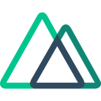
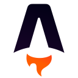
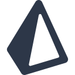
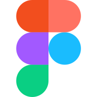
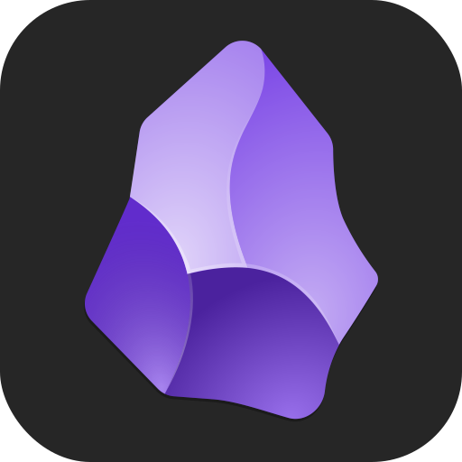

## About Me

- My name is **Kayn**.
- I am a **software engineering student**.
- Programming is not just about study & work, it's my passion.
- I enjoy learning the most cutting-edge and advanced technologies.
- I wanna become a **polymath programmer** instead of a Full Stack Developer. This means that while I am committed to diving deep into one specific area, I also want to learn across the entire programming landscape. Because I refuse to stay at the surface.

---

## GitHub Highlights

  
  

  

---

## Tech Stack

### Frontend Technologies

  
  
  
  
  
  
  
  
  
  
  
  

### Backend Technologies

  
  
  
  
  
  

### Development Tools

  
  
  
  
  
  

  
  
  

### Game Development

  
  

---

## Learning Tools

-  **Notion** — The best productivity software. I use it to set up my to-do lists (scheduling), record my study notes, and organize my project materials.
-  **Obsidian** — My second brain, used to build network connections of knowledge, and also taught me how to write Markdown.
-  **Anki** — Spaced repetition software that helps me efficiently memorize knowledge points and English vocabulary.
-  **Gemini** — In this AI era, LLM has become an indispensable learning companion. Many AIs can complete daily tasks, but when it comes to literature review, Gemini is undoubtedly the best.

---
